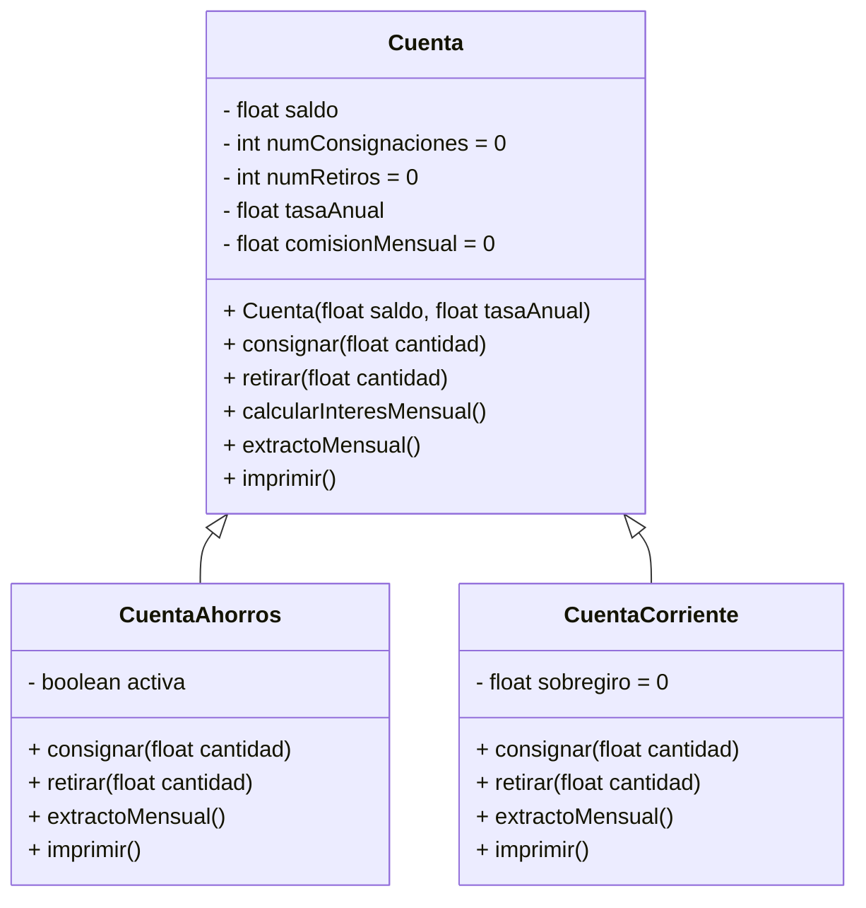

# 🏦 Proyecto: Cuenta Bancaria

## 📌 Descripción
Este proyecto implementa un modelo orientado a objetos de una **cuenta bancaria**, incluyendo una clase base `Cuenta` y dos clases derivadas: `CuentaAhorros` y `CuentaCorriente`.  
El sistema gestiona operaciones como consignaciones, retiros, cálculo de intereses, extractos mensuales y control de comisiones.

---

## 📂 Estructura de Clases

### 🔹 Clase `Cuenta`
- **Atributos (protegidos)**  
  - `saldo: float`  
  - `numConsignaciones: int` (inicia en 0)  
  - `numRetiros: int` (inicia en 0)  
  - `tasaAnual: float`  
  - `comisionMensual: float` (inicia en 0)  

- **Métodos**  
  - `consignar(float cantidad)`  
  - `retirar(float cantidad)`  
  - `calcularInteresMensual()`  
  - `extractoMensual()`  
  - `imprimir(): string`  

---

### 🔹 Clase `CuentaAhorros` (hereda de `Cuenta`)
- **Atributos**  
  - `activa: boolean` (inactiva si el saldo < 10000)  

- **Métodos redefinidos**  
  - `consignar(float cantidad)` → Solo si está activa  
  - `retirar(float cantidad)` → Solo si está activa  
  - `extractoMensual()` → Cobra comisión extra si hay más de 4 retiros  

- **Método adicional**  
  - `imprimir(): string` → Retorna saldo, comisión mensual y total de transacciones  

---

### 🔹 Clase `CuentaCorriente` (hereda de `Cuenta`)
- **Atributos**  
  - `sobregiro: float` (inicia en 0)  

- **Métodos redefinidos**  
  - `retirar(float cantidad)` → Permite sobregiro  
  - `consignar(float cantidad)` → Reduce sobregiro si existe  
  - `extractoMensual()`  

- **Método adicional**  
  - `imprimir(): string` → Retorna saldo, comisión mensual, transacciones y sobregiro  

---

## 📊 Diagrama de Clases (Mermaid)

